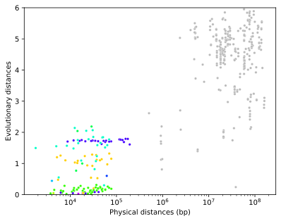

#### <span style="color: #98817B;"> **One family analysis**</span>
##### <span style="color: #98817B;"> **Summary tables**</span>

**Table 1. Genome-wide organization of gene family clusters**

-This table informs about how many genes are organized in clusters (*Clustered* category) or are not (*Singleton* category) in the entire genome. Note that all the scaffolds are considered here. 

-Two additional categories will appear if there are overlapping clusters. In this case you may consider to use/try a different g value.

  - *Repeated genes* - the total number of genes that are found in more than one cluster. 
  - *Overlapping clusters* - the total number of clusters that are partially overlapped.

</br>

**Table 2. Gene family cluster organization per scaffold**

-This table informs about how many genes are organized in clusters (*Clustered* category) or are not (*Singleton* category) in each (selected) scaffold.

</br>

**Table 3. Gene family cluster sizes**

-This table contains a more explicit information about the size of each cluster in each scaffold. 

- **Note:** clusters are labeled in this format "*#ClusterNUM*" (i.e. Cluster1) while singletons are labeled using this one "*#SNUM*" (i.e. #S1)

</br>

**Table 4. Gene family membership**

-This table contains detailed information at gene level, specifically, gene coordinates and membership (singleton or clustered).

</br>

(**Additional tables**) If proteins are provided:

**Table 5. Cst index at genome level**

-Evolutionary indexes measured across the entire genome

$$
C_{ST} = {D_T - D_C \over D_T}
$$

- **Cst**: index which measures the proportion of the evolutionary distance that is attributable to unclustered genes
- **Dt**: the average of the pairwise evolutionary (amino acid replacements per site) distances between gene family copies
- **Dc**: the average of the pairwise evolutionary distance between copies from within a cluster, averaged across all clusters of the same scaffold (or across the genome)

NOTE: overlapping genes are excluded from the computation of evolutionary statistics.

More information about the definition evolutionary indexes: [[1](https://doi.org/10.1111/1755-0998.13471)]

</br>

**Table 6. Mann-Whitney test results**

- **Cst** index measured for each scaffold in the genome

</br>

**Table 7. Mann-Whitney test raw data**

-Raw data used for Mann-Whitney test.

</br>

#### <span style="color: #98817B;"> **Two family joint analysis**</span>
##### <span style="color: #98817B;"> **Summary tables**</span>
**Table 1. Two gene families cluster organization**

- This table appears only when there are clusters formed by members of both families. If so, the information corresponding to those genes is excluded from *Tables 2-4*. 
- NOTE: If this table is not generated, the below tables (*Tables 2-4*) will be named as *Tables 1-3*.

</br>

**Table 2a. Genome-wide organization of FAM1 gene family clusters**

- Same definition as *Table 1.* from *One family analysis* section. 
- NOTE 1: Please remember that this table doesn't include the genes of FAM1 that belong to clusters formed by two gene families (*Table 1.* from *Two family joint analysis*) .
- NOTE 2: If this table is empty and *Table 1.* is present, probably all the genes of FAM1 are clustered with genes of FAM2. Additionally, *Table 2b, 2c* should also be empty.

</br>

**Table 2b. FAM1 gene family cluster organization**

- Same definition as *Table 2.* from *One family analysis* section. 

</br>

**Table 2c. FAM1 Gene family cluster sizes**

- Same definition as *Table 3.* from *One family analysis* section. 

</br>

**Table 3a. Genome-wide organization of FAM2 gene family clusters**

- Same definition as *Table 1.* from *One family analysis* section. 
- NOTE 1: Please remember that this table doesn't include the genes of FAM2 that belong to clusters formed by two gene families (*Table 1.* from *Two family joint analysis*) .
- NOTE 2: If this table is empty and *Table 1.* is present, probably all the genes of FAM2 are clustered with genes of FAM1. Additionally, *Table 3b, 3c* should also be empty.

</br>

**Table 3b. FAM2 gene family cluster organization**

- Same definition as *Table 2.* from *One family analysis* section. 

</br>

**Table 3c. FAM2 Gene family cluster sizes**

- Same definition as *Table 3.* from *One family analysis* section. 

</br>

**Table 4. FAM1 and FAM2 gene families membership**

- Same definition as *Table 4.* from *One family analysis* section. 

</br>

#### <span style="color: #98817B;"> **Table fields explanation**</span>

- **FamID**: gene family identifier

- **ScaffoldID**: scaffold raw name (i.e. Scaffold_15362_HRSCAF_19823)

- **ScfLength**: scaffold length (in bp)

- **ScfName**: scaffold associated name (i.e. ChrX)

- **ClusterID**: cluster ID number (i.e. Cluster1) or single copy gene ID (i.e. #S1).
    - The numbering starts from '1' to 'n' on each scaffold.

- **GenesNumber**: Number of genes.

- **Composition**: informs about how many genes of each FAM1 and FAM2 belong to the same cluster (found only in two families joint analysis). For example: 11 (8, 3) would mean that there is a cluster formed by 11 genes, 8 belong FAM1 and 3 belong to FAM2.

- **Category**:
    - **Singleton**: refers to those genes that are not clustered with any other gene.
    - **Clustered**: refers to those genes that are clustered with other.

- **GeneID**: 
    - In single families analysis: the original gene name present in the input coordinates file (GFF3 or BED2). In case of BED1 format, the gene name is assigned automatically.
    - In two families joint analysis: the gene name present in the input coordinates file (GFF3 or BED2). In case of BED1 format, the gene name is assigned automatically. In this case, the gene names have a prefix that refer to their gene family. This was implemented to avoid the possible confusion due to equal naming of two genes belonging to two different families. For example: consider two gene families: GR and IR, and their respective genes: g123 and g123. They will be renamed as GRfam_g123 and IRfam_123 at the very beggining of the analysis.

- **GeneID_original**: the original gene name present in the input coordinates file (GFF3 or BED2). In case of BED1 format, the gene name is assigned automatically. (This field is found only in two families joint analysis).

- **GeneStart**: gene start coordinate on scaffold

- **GeneEnd**: gene end coordinate on scaffold

- **ClusteredGenes**: number of clustered genes

- **NotClusteredGEnes**: number of not clustered genes (number of singletons)

- **pvalue**: Mann-Whitney test p-value

- **significance**:
    - "**NS**": not significant, p-value >= 0.05
    - "**\***": significant, p-value < 0.05
    - "**\*\***": significant, p-value < 0.01
    - "**\*\*\***": significant, p-value < 0.005

- **GenePair_status**:
    - **NotClustered**: when a given pair of genes (GeneID1 and GeneID2) is not clustered
    - **Clustered**: when a given pair of genes (GeneID1 and GeneID2) is clustered

</br>

#### <span style="color: #98817B;"> **Example Output plots **</span>
**Figure 1. GR_Global_ClusterSize_Distribution.svg**
<div>
- This bar plot summarizes the distribution of gene clusters across the main scaffolds of the genome.

```{r, out.width="75%", echo=FALSE}
library(knitr)

```

**Figure 2. GR_ClusterSize_Distribution_by_Scaffolds.svg**
<div>
- This bar plot summarizes the distribution of gene clusters size for each of the main scaffolds (chromosomes).
- **NOTE: ** Individual bar plots, for each scaffold, are also provided in `Individual Plots` tab.
```{r, out.width="75%", echo=FALSE}
library(knitr)

```

(**Additional plots**) If proteins are provided:

**Figure 3. GR_fam.GlobScatterPlot_1.0g.svg**
<div>
- This scatterplot plot shows the comparison of physical vs evolutionary distances between genes. Clustered genes' data is colored, the unclustered data is shown in grey. In this case, each color corresponds to one scaffold.

```{r, out.width="65%", echo=FALSE}
library(knitr)

```

**Figure 4. *Dysdera silvatica* Chromosome 6 (Scaffold_15361_HRSCAF_19822). Physical distance heatmap**
<div>
- Physical distance heatmap (in Mb units) with two clusters enclosed within black square shapes.

```{r, out.width="75%", echo=FALSE}
library(knitr)

```

**Figure 5. *Dysdera silvatica* Chromosome 6 (Scaffold_15361_HRSCAF_19822). Physical vs Evolutionary distance heatmap**
<div>
- On the left, the heatmap displays physical distance (in Mb units, below the diagonal) vs evolutionary distance (in amino acid substutions per site, above the diagonal).
- On the right, the same information is shown as a scatterplot where each colored dot corresponds to a pair of clustered (in color) or unclustered genes (in grey). Note that, each cluster data is shown in a different color.
- The two identified gene clusters are enclosed within black square shapes.

```{r fig.show = "hold", out.width = "50%", fig.align = "default", echo=FALSE}


```

</br>

**Figure 6. *Dysdera silvatica* Chromosome 5 (Scaffold_3225_HRSCAF_3759). Physical distance heatmap**
<div>
- Joint analysis of *Gr* and *Ir* gene femilies. 
- Physical distance heatmap (in Mb units). *Gr* gene clusters are enclosed in black square shapes; *Ir* gene clusters in blue square shapes; *Gr+Ir* gene clusters, containing members of both families, in red square shapes.

```{r, out.width="75%", echo=FALSE}
library(knitr)

```

</br>


#### <span style="color: #98817B;"> **References**</span>

[1] [The chromosome-scale assembly of the Canary Islands endemic spider Dysdera silvatica (Arachnida, Araneae) sheds light on the origin and genome structure of chemoreceptor gene families in chelicerates](https://doi.org/10.1111/1755-0998.13471)


